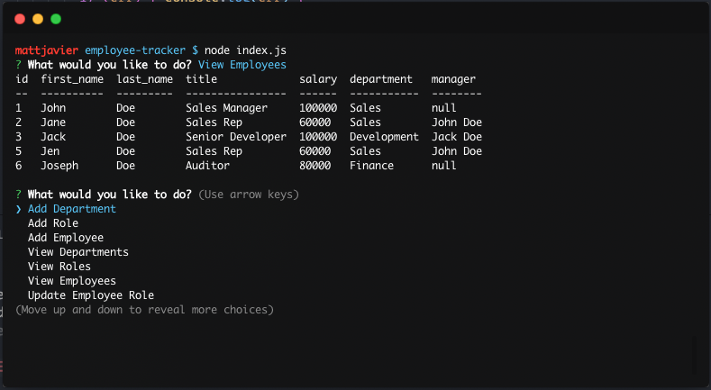
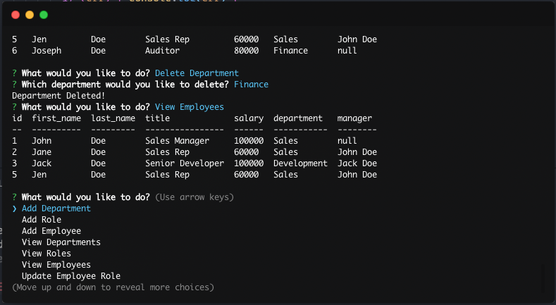

# Employee Tracker

A CLI program that simulates a Content Management System. Users of this application can perform various queries on an employee SQL database.

The application is built using Node.js, the [Inquirer npm package](https://www.npmjs.com/package/inquirer), and MySQL.

## Usage 

To use this application, download the code from this [repository](https://github.com/mattjavier/employee-tracker).

Make sure to get all the dependencies by running the following in your terminal.
```bash
npm i
```

## Testing

In your terminal, run the following:
```bash
node index.js
```

You will be prompted with questions that may require selecting choices or typing in an input text. 

## Images

* The start of the application, run with `node index.js`
  


* A command to display all current employees, uses a 'SELECT' query in the backend



* As shown below, deleting a department, 'Finance', deletes all employees under that department



## Demo Video

A demo video is available in the `assets/` directory and can also be viewed [here](https://drive.google.com/file/d/19kJLg4q110EwTy0Tp1_vWydA13XyZ9c9/view).